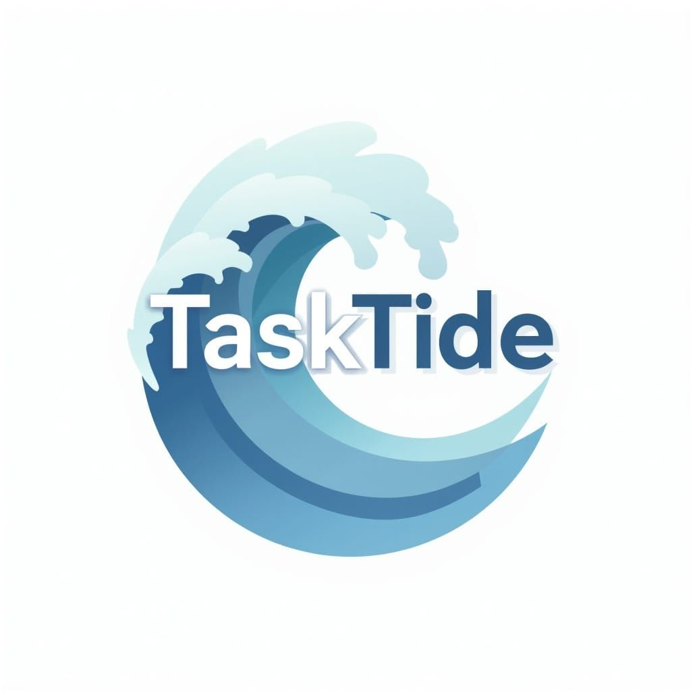
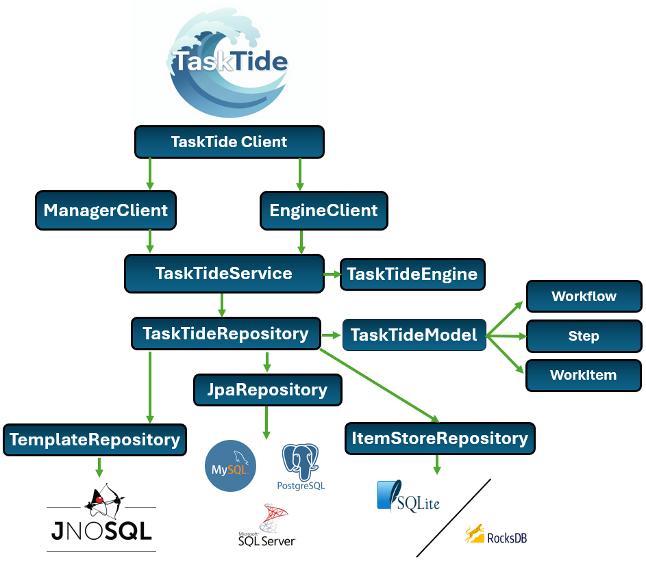

  

# TaskTide

  
  

**TaskTide** is a modular, **Pilot Job System** designed for modern **HPC**, **Grid**, and **Edge Computing** workloads. It enables execution of **ETL-style workflows** using dynamic tasks.

---

## 🚀 Features

- 🛠️ **Pilot Job Execution Model** – Tasks are dynamically scheduled and executed inside long-running jobs.
- 🔄 **ETL-Friendly**: Tasks are treated as extraction, transformation, or loading scripts/programs.
-  **Backend Agnostic** – Works with Document (e.g. MongoDB), Embedded (e.g. RocksDB), and Key-Value (e.g. Redis) stores.
- 💻 **Native Task Execution** – Runs any local or system executable/script.
- 🔀 **Nested Workflow Modeling** – Compose tasks into hierarchical workflows using a flexible domain model.
- 📦 **Gradle Ready** – Available on Maven Central for easy integration.
- 🧪 **Tested**: Built with CI/CD, Docker support, and integration tests across database types.

---

## 🧱 Architecture

- **Core Model** – Defines the stateful task and workflow data structure.
- **Engine** – The CLI-based executor that processes and tracks WorkItems and their tasks.
- **Manager** – Provides access and services for workflows and persistence.

  

