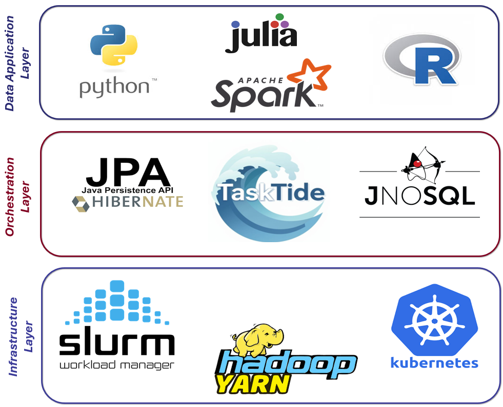
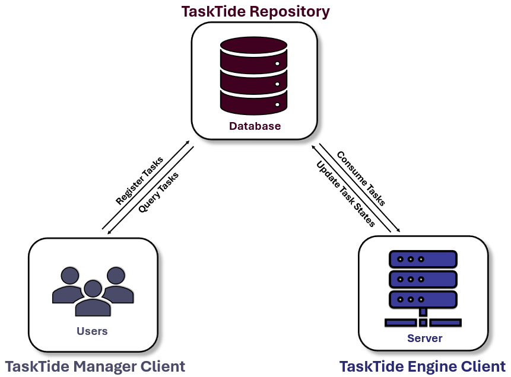
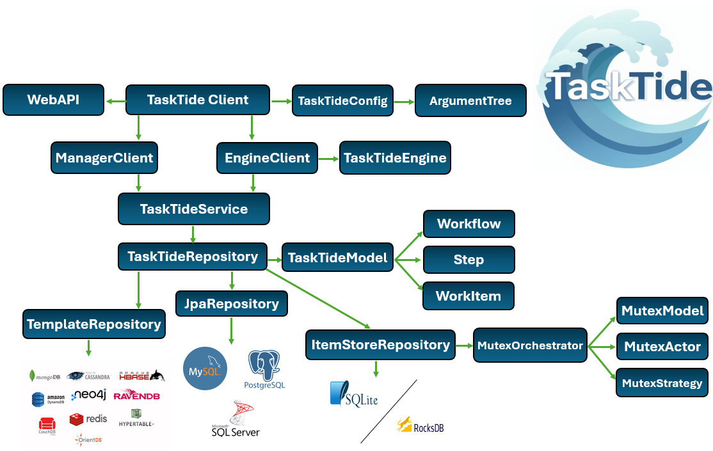
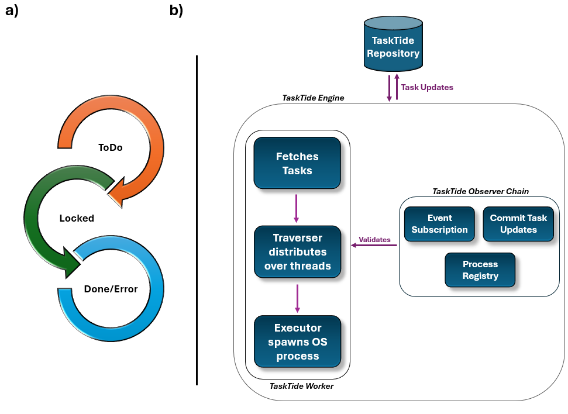
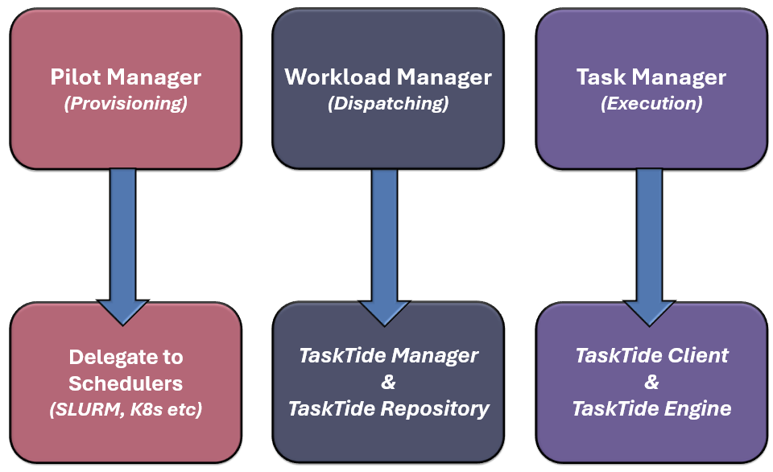
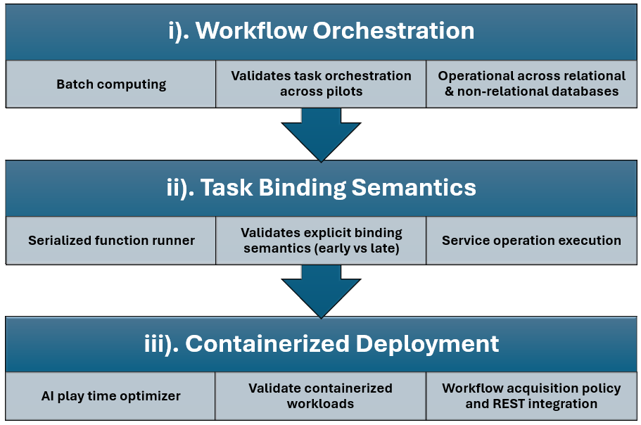
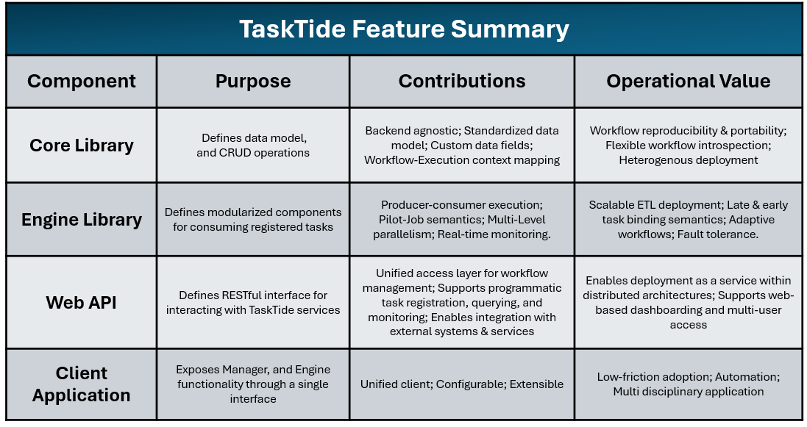
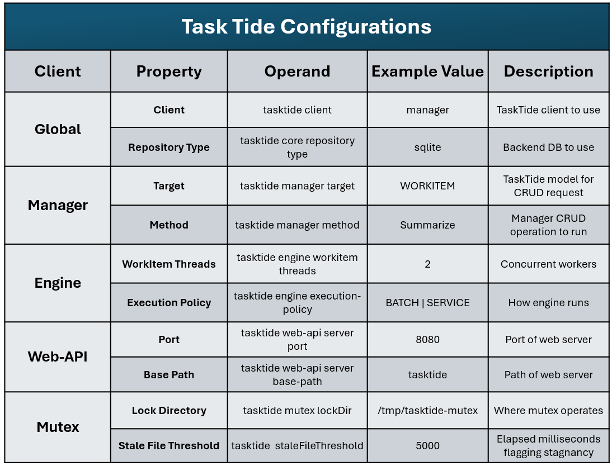
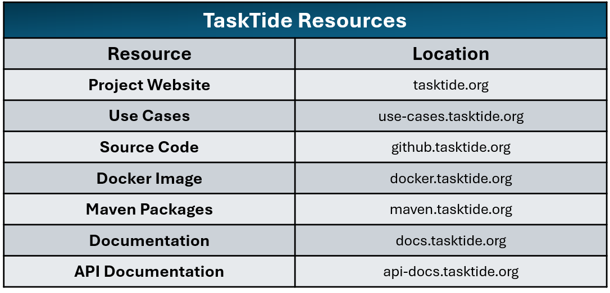

# Summary

TaskTide is a backend-agnostic workflow orchestration system designed to mediate the deployment of user-defined data applications across different computing environments (Figure 1). In data-intensive environments, workflows are defined by users independently from the platform on which they are executed. This separation of concerns creates a natural role for orchestration middleware responsible for coordinating operational elements such as persistent state, execution context, and task lifecycle management.

Through its persistent workflow model, TaskTide enables users to register, query, and modify workflow deployments as they are consumed across distributed compute resources. These capabilities provide end users with operational controls that support real-time interaction with workflow state and execution context. As a result, workflows can be deployed across heterogeneous computing environments, including HPC, cloud, and containerized environments, while retaining a unified perspective on workflow state and the execution context of data-application deployments (Figure 4).

TaskTide treats workflow management, execution-context tracking, runtime introspection, and lifecycle influence as first-class orchestration concerns, while resource scheduling, provisioning, and workload execution remain infrastructural responsibilities. Workflow semantics remain user-defined, either at runtime or within the application itself. This separation allows TaskTide to operate as lightweight orchestration middleware that integrates with diverse computing environments and application domains, as demonstrated through use cases spanning bioinformatics, distributed application execution, and containerized AI workloads (Table 3).

# Statement of Need

The growth of data-intensive research, services, and AI-driven applications has created new research opportunities for exploring how application execution can be coordinated across heterogeneous computing environments [@hop2024; @hop2026; @kenna2016; @nhlbi2016; @nicolas2018]. Technologies such as Hadoop, SLURM, and Kubernetes provide essential infrastructure-level resource management and job-execution capabilities for modern computing platforms [@burns2016; @giri2022; @salloum2016; @yoo2003]. End users must still deploy and coordinate domain-specific *Data Application Layer Systems* (DALS) across these environments. In this work, the architectural separation between end-user DALS and service-provider *Infrastructure Layer Systems* (ILS) is referred to as the *Orchestration Layer System* (OLS), where workflow intent must be translated into distributed execution [@ramakrishnan2011].

As workflow orchestration is not inherently owned by either DALS or ILS (Figure 1), the relationship between application instances and their execution context is often implemented through infrastructure-specific scripts and utilities tightly coupled to a given ILS. This places the burden of developing workflow state management, execution-context mapping, and lifecycle coordination on end users, reducing portability across computing environments. TaskTide addresses these operational concerns through a dedicated orchestration layer that persists workflow state independently of the underlying infrastructure (Figure 2). Beyond reducing workflow portability, the OLS gap introduces operational overhead for both end users and service providers. For end users, this creates development overhead for each workflow they need to deploy. For service providers, the OLS gap can blur the boundary between infrastructure-support responsibilities and workflow issues. These problems are amplified by the rapid evolution of application and infrastructure technologies, where tightly coupled solutions inherit platform-specific obsolescence risks.

These challenges highlight the need for flexible workflow orchestration systems designed to mediate the end-user experience without being tied to a specific backend technology. Such systems should decouple task scheduling from task execution and the underlying ILS, while elevating workflow state and execution context as first-class orchestration concerns that support real-time workflow introspection and lifecycle influence. TaskTide is a lightweight, daemon-less distributed workflow orchestration system for horizontally scaling DALS workloads across heterogeneous ILS. It operates across relational databases, NoSQL databases, and embedded databases. By treating workflow state as a persistent orchestration concern, TaskTide supports real-time workflow introspection and infrastructure-independent recovery. The same persistent state model enables decentralized worker coordination through optimistic task claiming with post-write ownership validation, removing the need for dedicated scheduling infrastructure.

# State of the Field

The separate concerns of DALS and ILS have motivated a rich ecosystem of workflow engines, middleware systems, and pilot-job abstractions, each focusing on different aspects of the OLS boundary. Workflow systems such as Snakemake, Airflow, and Nextflow provide mature frameworks for expressing, scheduling, and executing workload sequences through workflow-specific abstractions [@koster2012; @langer2025; @yasmin2025]. Complementing these systems, pilot-job frameworks such as DIRAC, WORCS, and PiCaS focus on decoupling workload execution from resource provisioning, enabling their use across diverse ILS [@boyer2022; @surf2025; @turilli2019].

With their differing focus, operational concerns such as task-lifecycle influence, execution-context mapping, and persistent workflow-state management are often addressed through combinations of workflow metadata, infrastructure adapters, execution environments, and application-specific utilities. Rather than representing these relationships through a dedicated operational abstraction, their implementation is typically influenced by the requirements of the surrounding workflow or infrastructure ecosystem.

TaskTide makes these operational concerns explicit through persistent workflow-state management by representing *Workflows*, *Steps*, *WorkItems*, *JobEnvironments*, and runtime metadata as first-class orchestration entities (Figure 3). This allows users to enrich TaskTide's data model with operational or domain-specific metadata while retaining real-time workflow introspection and lifecycle influence. With TaskTide's dynamic *Workflow* definition, execution behaviour, including parallelism and batch or service operation, and task acquisition, including step ordering and sequence flow, can be supplied at runtime. These operational controls provide end users with precise control over deployment behaviour without requiring changes to workflow definitions or underlying infrastructure mechanisms.

# Software Design

## Introduction

TaskTide is designed to bridge end-user DALS development and its scalable deployment across heterogeneous ILS (Figure 1). It achieves this by decoupling task scheduling from execution across ILS and maintaining associations between workflow intent and operational context (Figures 2 and 3). The following sections describe how TaskTide's architecture and operational model map to practical value for end users and service providers as an OLS solution (Table 1).

## TaskTide Data Model

TaskTide defines a standardized data model that enables reproducible and traceable DALS deployments. The model captures workflow intent and execution context through the persistent representation of *Workflows*, *Steps*, *WorkItems*, and *JobEnvironments*, together with their associated metadata (Figure 3). Motivated by the extraction, transformation, and loading pattern, a *Workflow* is a collection of distinct but related operations to be performed, such as an ETL sequence. Each distinct operation of a given *Workflow* is a *Step*, while individual *WorkItems* represent independently executable units of that *Step* [@gropp1996; @singh2022; @venkateswarlu2023]. This structure expresses *Workflows* as referential collections of independently executable *WorkItems*, making workflow distribution and horizontal scaling explicit aspects of the orchestration model. With its persistence model, TaskTide enables workflow state, execution progress, and execution contexts to be managed as first-class orchestration concerns while providing a shared coordination substrate for distributed worker execution.

To support workflow introspection and operational traceability, TaskTide persists task-lifecycle information and execution-context metadata. These include active *WorkItem* state, execution logs, scheduling identifiers, and host-specific parameters that collectively establish direct linkages between an application and its execution environment. Such mappings enable *Workflow* introspection, monitoring, runtime mutability, and reproducibility across heterogeneous ILS while remaining extensible through operational or domain-specific metadata.

## TaskTide Persistence and Execution Model

TaskTide coordinates workflow execution through a database-backed producer-consumer pattern (Figure 2), in which *EngineWorker* instances poll runnable *WorkItems* from a centralized repository rather than receiving explicit task assignments (Figure 4). Acquisition uses optimistic task claiming with post-write ownership validation, allowing decentralized task discovery without dedicated scheduling infrastructure. This complements TaskTide's backend-agnostic persistence layer, which supports relational and non-relational database systems and persists workflow state, task-lifecycle tracking, and execution metadata across backend technologies (Figure 3).

TaskTide's persisted workflow state enables incomplete *WorkItems* to be identified and reassigned independently of worker failures (Figure 2). Horizontal scaling is supported by deploying additional *EngineWorker* instances to consume available *WorkItems* from the shared repository without requiring workflow redistribution (Table 2). This repository-driven execution model remains independent of infrastructure schedulers and provisioning mechanisms (Figure 1).

User-defined execution policies determine how *EngineWorker* instances traverse and poll *WorkItems*, allowing workflows to be processed sequentially, cyclically, or by targeting a *Step* without redefining the *Workflow*. Integrating execution policies with *WorkItem* lifecycle states enables real-time, dependency-aware influence over *Workflow* progression. Lifecycle transitions are coordinated through the *EngineObserverChain*, which validates task progress and relays updates to the repository for real-time monitoring (Figure 4).

## Deployment

TaskTide supports deployment across heterogeneous ILS environments, including HPC, cloud, containerized, and distributed-service configurations. Its modular architecture separates workflow orchestration from execution infrastructure, allowing the *Manager* and *Engine* components to be deployed independently according to the requirements of a service environment (Table 1). A unified client provides a common mechanism for configuring these components, while backend-agnostic dependencies enable operation across diverse database and infrastructure environments (Table 2).

Deployment-specific configuration is externalized through command-line options and conventional application-properties files. Execution policies, workflow sequences, and batch or service operations can therefore be adapted per instance while coordinating through a centralized persistence layer (Figure 2). The same configuration model supports standalone batch execution, service operation across server farms, or web-service deployment. By separating workflow definition, orchestration, and infrastructure concerns, TaskTide reduces platform-specific integration and the need for bespoke orchestration solutions while improving workflow portability across heterogeneous ILS.

## Relation to the Pilot-Job Abstraction

TaskTide's design was motivated by treating an ETL as the base unit of work for the pilot-job abstraction (Figures 2 and 5). The combination provides a natural separation between what is executed and how it is scaled: ETL workflows encapsulate data processing, while pilots provide execution capacity. Within TaskTide, these patterns are represented as persistent operational elements. ETL elements are captured through actionable data models, namely *Workflows*, *Steps*, and *WorkItems*, while pilot-job execution fleets are represented through *JobEnvironments* and associated metadata.

TaskTide persists actionable ETL elements within a centralized repository, from which they are consumed by *TaskTide-Engine* instances deployed across pilot-job fleets. This separation expresses workload scaling through a common operational model while resource provisioning remains the responsibility of the underlying ILS (Figure 5). Scheduler-specific provisioning mechanisms can be represented through TaskTide configurations and delegated to the native scheduling interfaces of the lower ILS (Table 2). Workload dispatch is coordinated by the *TaskTide-Repository*, while execution is performed by *TaskTide-Engine* instances deployed within provisioned ILS jobs (Figure 2). This separates workflow-state management and execution-context tracking from resource scheduling and provisioning, which remain responsibilities of the lower ILS (Figures 1 and 5).

In TaskTide, *EngineWorkers* select tasks rather than receiving explicit assignments. Workers independently attempt ownership of runnable tasks. After persisting a unique lock identifier, a worker re-polls the task and proceeds only when the persisted ownership record matches its claim. This decentralized protocol allows concurrent task discovery, avoids dedicated scheduling infrastructure, and ensures that only successfully validated owners execute claimed *WorkItems*. TaskTide does not claim global exactly-once processing semantics; it instead relies on the ownership protocol and workflow design to maintain execution correctness.

The ETL and pilot-job patterns provide complementary forms of scaling. At the ETL level, the number of tasks within a *Step* can reflect practical data-slicing requirements, while workflow definitions retain related data-wrangling and cleaning tasks as explicit operational stages. At the pilot-job level, execution capacity can be adjusted according to the number of tasks processed by each instance and the desired degree of serial or parallel execution. Together, these scaling dimensions provide a common operational model between DALS applications and their deployment across service-provider ILS environments. By separating workflow definition, pilot provisioning, and workflow processing, TaskTide remains backend-agnostic while retaining the scalability, flexibility, real-time introspection, and workflow-level influence associated with the combined ETL and pilot-job model.

# Research Impact Statement

TaskTide originated from workflow-orchestration requirements encountered during data-engineering work supporting large-scale biomedical research projects [@hop2024; @hop2026; @kenna2016; @nicolas2018]. The author contributed to these projects as a data engineer, where recurring requirements included workflow-state management, execution-context tracking, lifecycle coordination, and deployment across heterogeneous computing resources. These projects are cited as provenance for the system's requirements rather than as evidence of TaskTide usage.

TaskTide is distributed with source code, packages, container images, deployment documentation, API references, and representative use cases spanning bioinformatics, distributed execution, and containerized AI workloads (Table 3), supporting independent evaluation, reuse, and adoption.

# AI Usage Disclosure

The design, architecture, implementation, evaluation, and scientific claims of TaskTide were developed by the author. AI tools were not used to design the TaskTide workflow-orchestration model, scheduling approach, state-management mechanism, or system architecture. ChatGPT and Microsoft Copilot were used during manuscript preparation to improve readability and presentation. AI-generated outputs were reviewed and adapted by the author before inclusion. Auxiliary demonstration code was generated for selected non-core example workloads.

\clearpage
# Figures and Tables

## Figure 1: High-Level Layered Architecture

<table style="border: 1px solid #555; border-collapse: collapse;">
<tr>
<td>
 

 
</td>
</tr>
</table>

**Figure 1:** Shows the positioning of the **TaskTide Orchestration Layer System**. This middleware sits between customer **Data Application Layer** development and **Infrastructure Layer** execution, mediating the sessionless scale-out of DALS instances across heterogeneous infrastructure layers, as demonstrated by selected use cases at `tasktide.org/use-cases`.

\clearpage
## Figure 2: TaskTide Operating Principle

<table>
<tr>
<td>
 

 
</td>
</tr>
</table>

**Figure 2:** Shows the **producer-consumer** operating principle of the TaskTide workflow engine. **1) The TaskTide Manager** command-line client is the interface through which users register and query tasks across user-defined workflows. **2) The TaskTide Repository** is the ambassador interface that manages task storage and retrieval and persists its data to the configured backend database, whether NoSQL or SQL. **3) The TaskTide Engine** command-line client consumes the required task set or sets of tasks.

\clearpage
## Figure 3: TaskTide Architecture

<table>
<tr>
<td>
 

 
</td>
</tr>
</table>

**Figure 3:** Shows the architecture of the **TaskTide Workflow Orchestration Engine**.

\clearpage
## Figure 4: TaskTide WorkItem Lifecycle

<table>
<tr>
<td>
 

 
</td>
</tr>
</table>

**Figure 4:** Shows the persistent lifecycle of tasks registered in TaskTide (**6-a**), which is enacted by the TaskTide Engine (**6-b**). **1) The TaskTide Engine** fetches the configured workload from the TaskTide Repository. **2) The TaskTide Engine Worker** distributes available tasks across configured thread pools for parallel processing. **3) TaskTide Engine Executor** instances spawn operating-system processes for task execution and expose data-model identifiers as environmental variables for tasks to use. **4) The TaskTide Engine Observer Chain** subscribes to key lifecycle transition points, namely `onTaskStart`, `onTaskProcessing`, and `onTaskEnd`, and performs related task validation (**6-a**).

\clearpage
## Figure 5: Mapping TaskTide to the Pilot-Job Abstraction

<table>
<tr>
<td>
 

 
</td>
</tr>
</table>

**Figure 5:** Shows how TaskTide's sessionless internals map to the pilot-job abstraction. **1) Pilot provisioning** is delegated to the underlying platform, as task tracking is more relevant to TaskTide as DALS intent than a given job as an ILS concern. **2) Workload management** is implemented by the TaskTide Repository, where the configured database acts as the single source of truth for **task lifecycle management** and where **binding semantics** are expressed. **3) Task execution** is performed by instances or fleets of the TaskTide Engine client. The engine **polls available tasks** from configured or arbitrary collections, executes their units of work, and feeds back updates observed across the execution process in real time, including logs and current and completed state.

\clearpage
## Figure 6: High-Level Development Approach

<table>
<tr>
<td>
 

 
</td>
</tr>
</table>

**Figure 6:** Shows the **iterative and incremental** development approach used for TaskTide. Each stage had key deliverables supported by a use-case implementation. **1) Workflow orchestration** was verified using bioinformatics pipelines. **2) Task binding semantics** were explicitly verified using a serialized Julia function runner for early task binding and a SparkR image-analysis application for late task binding. **3) Containerized deployment** was verified using an AI play-time optimizer Python application.

\clearpage
## Table 1: TaskTide Feature Summary

<table>
<tr>
<td>
 

 
</td>
</tr>
</table>

**Table 1:** Summarizes the **feature contributions** of TaskTide's modules and translates these features into their **operational value**.

\clearpage
## Table 2: TaskTide Configurations

<table>
<tr>
<td>
 

 
</td>
</tr>
</table>

**Table 2:** Shows an example set of **TaskTide Client Configuration** properties.

\clearpage
## Table 3: TaskTide Resources

<table>
<tr>
<td>
 

 
</td>
</tr>
</table>

**Table 3:** Summarizes the primary **TaskTide resources**. High-level resources provide project overviews and representative use cases for prospective users, while technical resources provide source code, package dependencies, implementation guidance, deployment documentation, and API references for software developers and service providers.

\clearpage